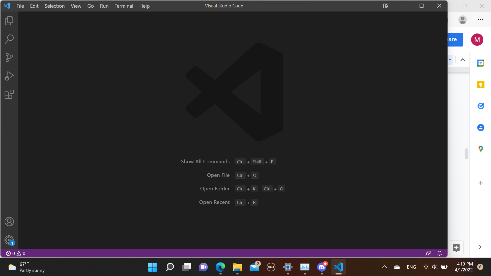
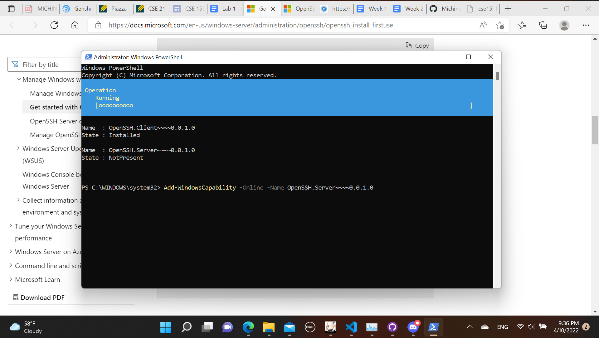
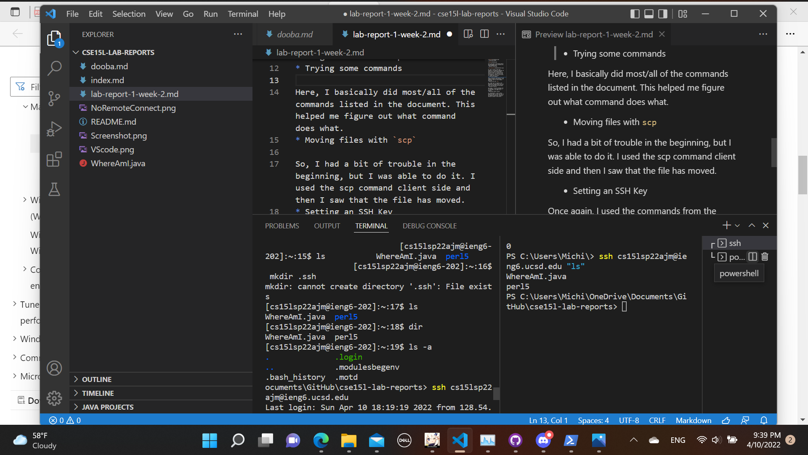
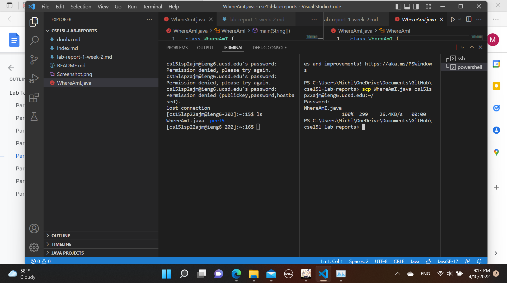
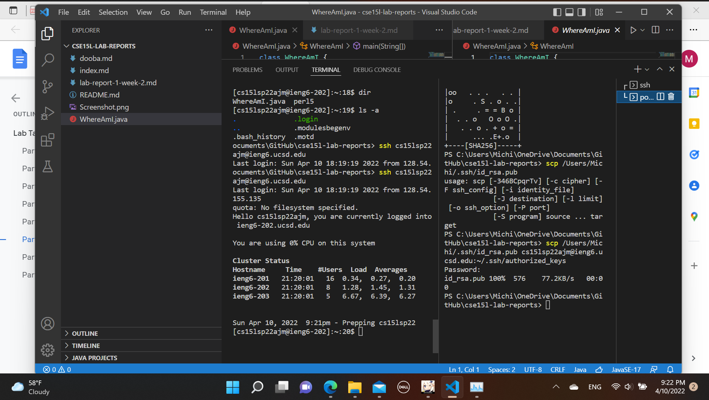
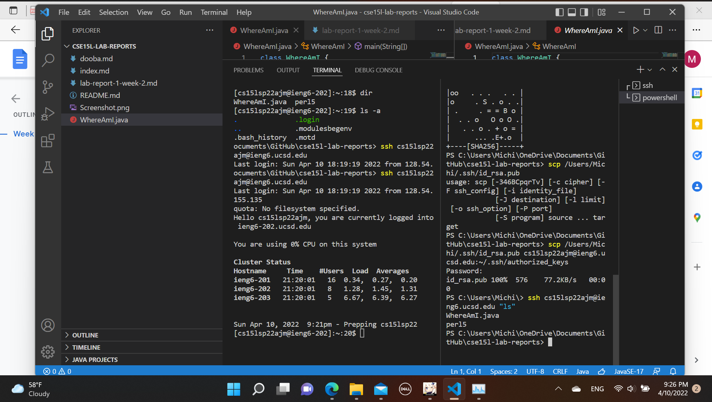

* Installing VScode

So we just got on the VScode website and downloaded the app. Nothing else really happened here.
* Remotely connecting

So, here is where I have some problems. I am unable to download the server ssh. I have used multiple methods and went to office hours to try to fix this, but nothing really helped so far. I was able to do the ssh command to connect to the server, so I guess that is a plus.
* Trying some commands

Here, I basically did most/all of the commands listed in the document. This helped me figure out what command does what.
* Moving files with `scp`

So, I had a bit of trouble in the beginning, but I was able to do it. I used the scp command client side and then I saw that the file has moved.
* Setting an SSH Key

Once again, I used the commands from the document. I was able to make it so that there is no need for a password.
* Optimizing remote running

So, unfortunately, I don't really understand this. I think that this is basically about how now I am able to do commands client-side, instead of having to connect to the server.

