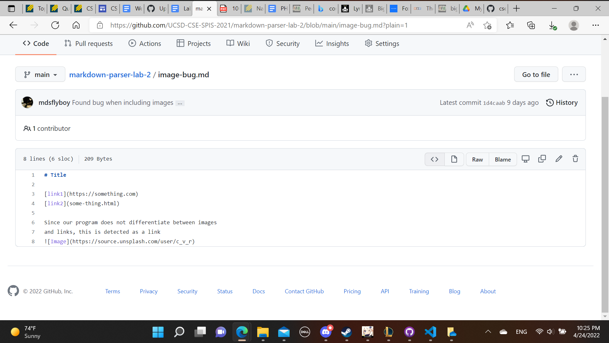
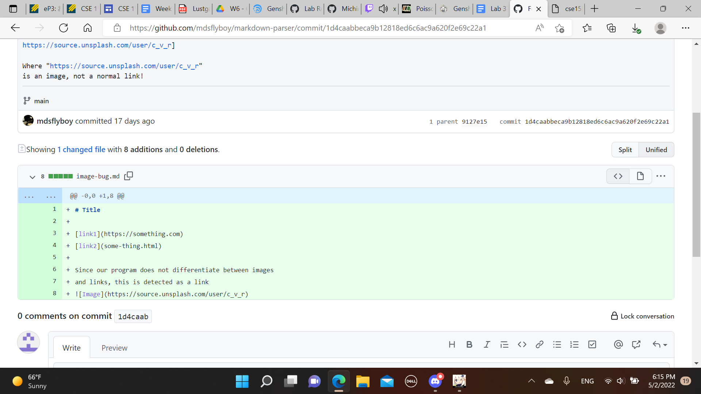
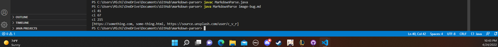
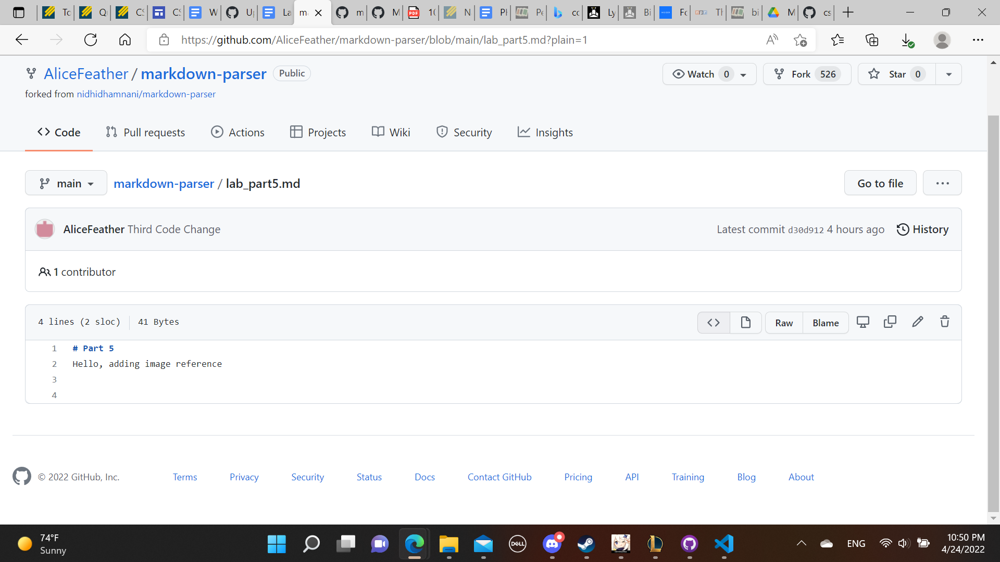
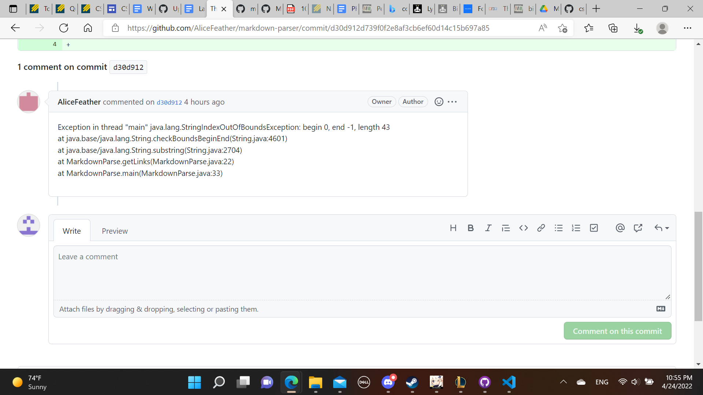
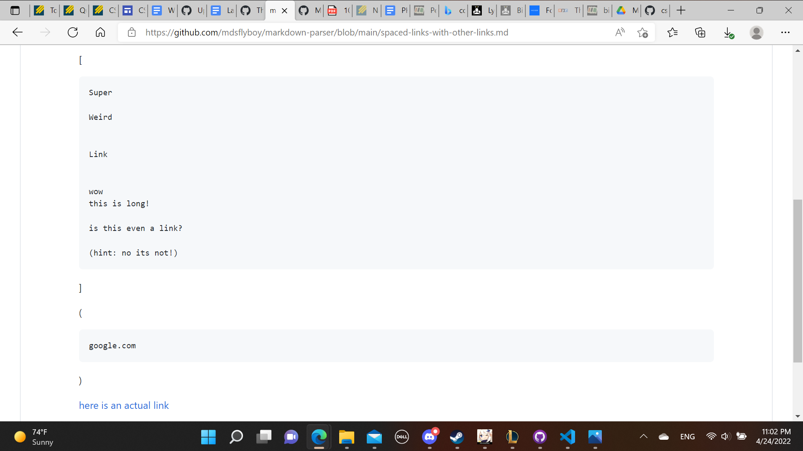
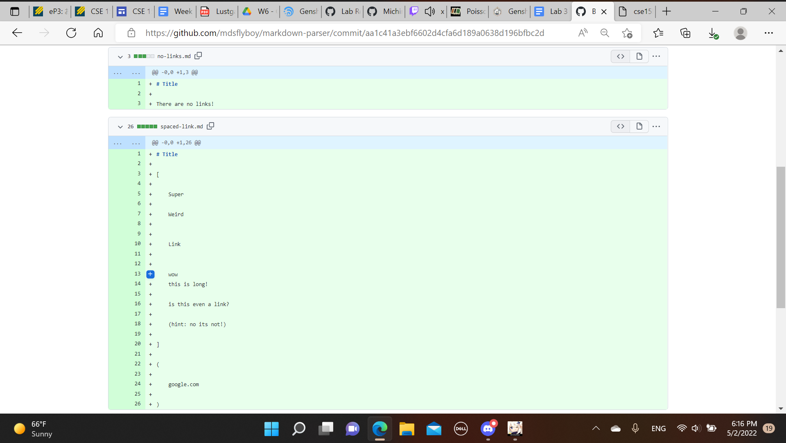
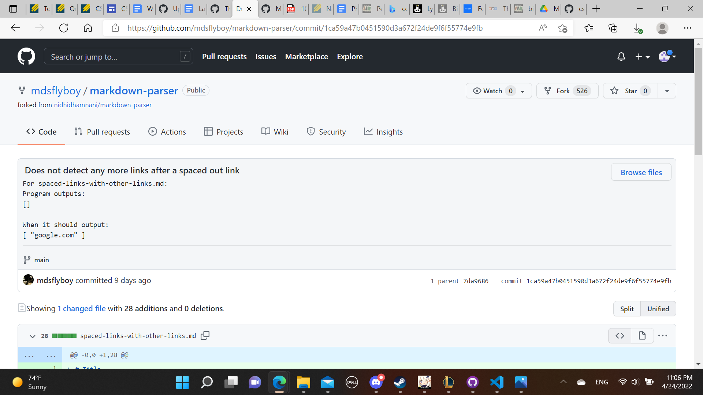

Hello, I am unable to fork the repository from my group, so I will use links from their github.

# Bug when there is an image

[https://github.com/mdsflyboy/markdown-parser/blob/aa1c41a3ebf6602d4cfa6d189a0638d196bfbc2d/image-bug.md?plain=1](https://github.com/mdsflyboy/markdown-parser/blob/aa1c41a3ebf6602d4cfa6d189a0638d196bfbc2d/image-bug.md?plain=1)

The bug is that the the code does not differentiate between images and links. As such, the sympton is that it reports the the image is a link, and the failure-inducing input is that there is an image in the file.

# Found a bug when there is no link

[https://github.com/AliceFeather/markdown-parser/blob/main/lab_part5.md](https://github.com/AliceFeather/markdown-parser/blob/main/lab_part5.md)

For this one, I wasn't able to replicate it, as I think I already fixed it so that it would work. So, I have used the error on their page so that we can see what happened. The bug was that it would look for a string, but it was not able to find one, thus creating the symptom, in which the failure inducing input is the file without links.

# Found a bug when the links were spaced

[https://github.com/mdsflyboy/markdown-parser/blob/main/spaced-links-with-other-links.md](https://github.com/mdsflyboy/markdown-parser/blob/main/spaced-links-with-other-links.md)

Unfortunately, I wasn't able to replicate this bug (as I probably already fixed it), so I am showing the image from my teammate's github page. Apparently, the bug is that it does not read the link that are spaced out and just stops, and the symptom is that nothing is being read/outputted. The failure-inducing input is that a file with spaced-out links/
