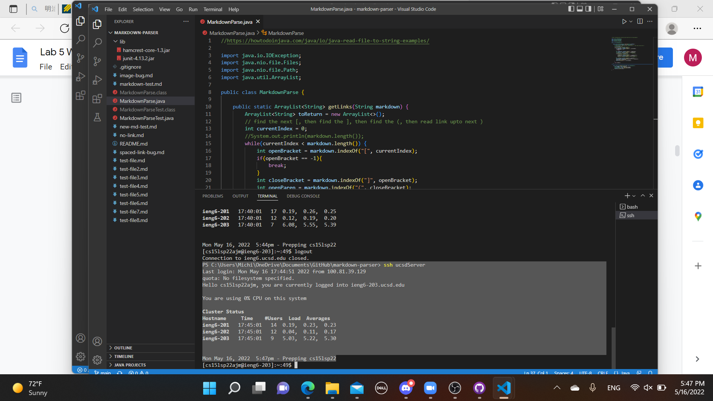
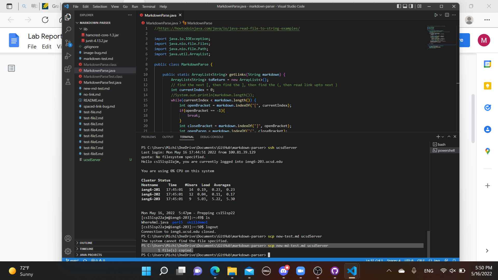
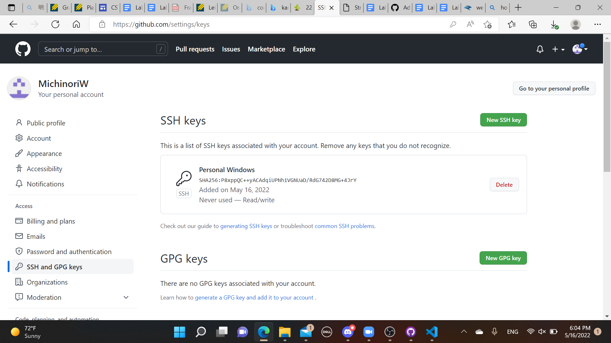
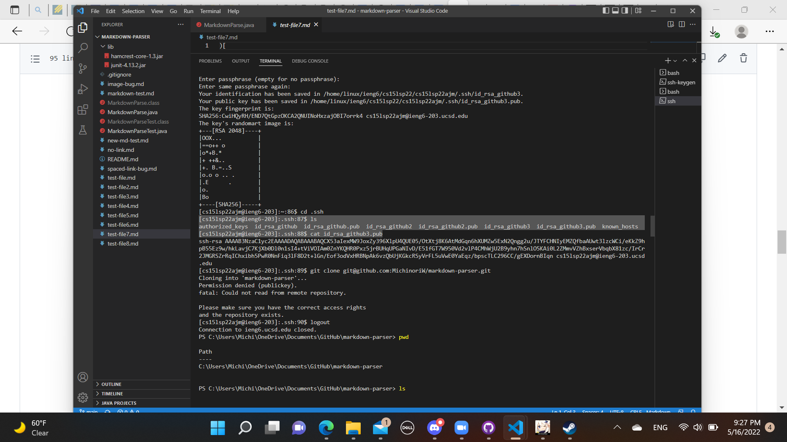
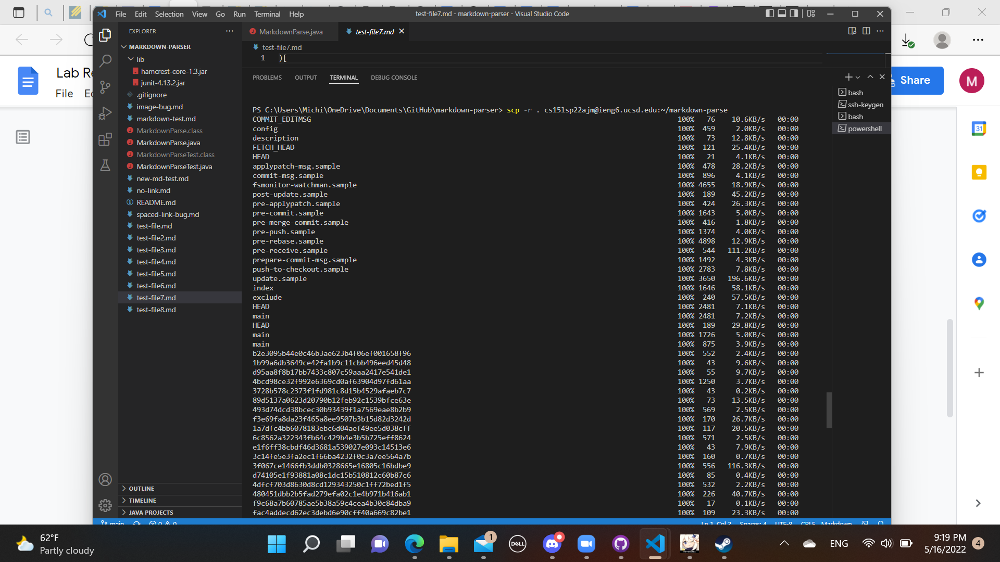
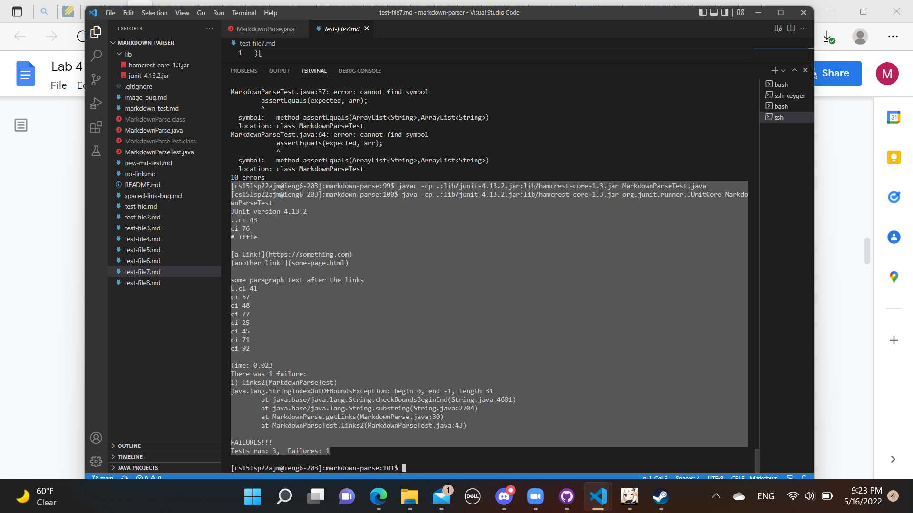
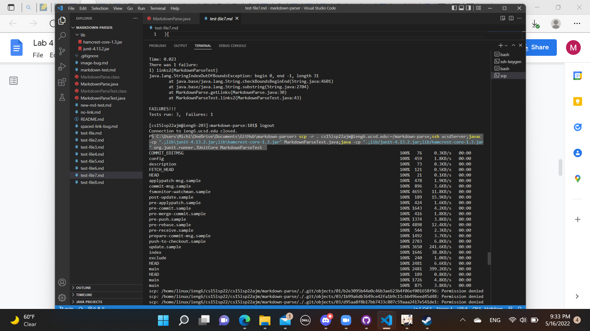

# Streamlining ssh Configuration

- We make it easier for use to log into the ssh server. We can make our own way to log in 

# Setup Github Access from ieng6

- We should be able use git commands from ieng6. However, I can't for some reason... (I also tried to make multiple keys here, didn't work)

# Copy whole directories with `scp -r`

- I think that this is pretty self-explanitory. We copy the directory from the client to the server.
