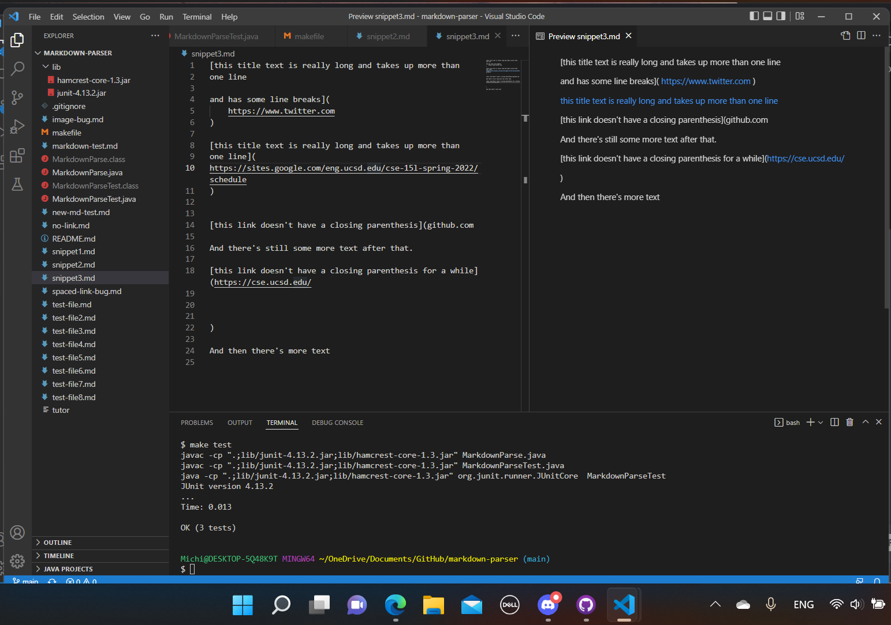

[my link](https://github.com/MichinoriW/markdown-parser)

[other group's link](https://github.com/Sking56/markdown-parser)

# What the links should produce

The expected output for snippet 1 is [`google.com, google.com, ucsd.edu].

The expected output for snippet two is [a.com, `a.com(()), example.com].

The expected output for snippet three is [https://www.twitter.com, https://sites.google.com/eng.ucsd.edu/cse-15l-spring-2022/schedule, https://cse.ucsd.edu/].

- All our tets work. For snippet 1, we need to keep track of whether something is in front of the brackets. Our code already keeps track of whether there is something in front of the brackets.
- For snippet 2, we need to keep track of parenthesis. Our code already
keeps track of the parenthesis.
- for snippet 3, we need to keep track of newlines. Our code already keeps track of them.

# Other groups's code

 - for snippet 1, I do think that there could be a small code change that would fix it. The code should keep in mind where the backticks are, and if it is outside the link markdown line (or whatever it is called), it should disregard that line.
 - for snippet 2, I think that we could make a small code change. I think that we could pair up the brackets and the parenthesis, so that it checks whether the link is correct or not.
 - for snippet 3, I do think that there could be a small code change that could fix it. The code just needs to keep in mind where the newlines are.