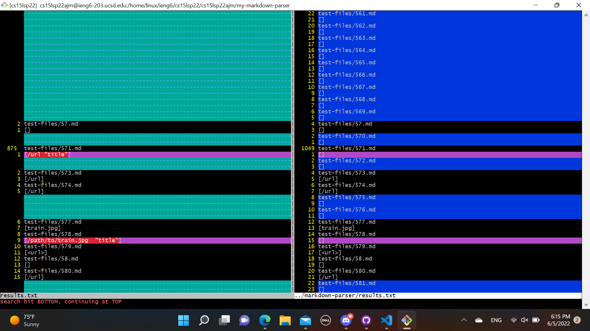
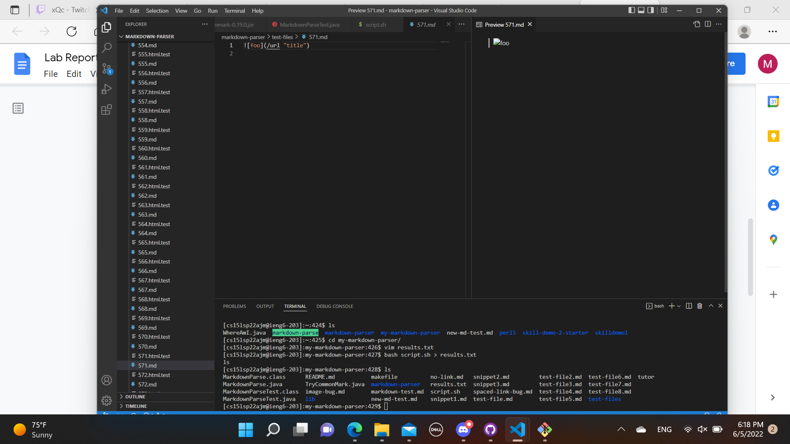
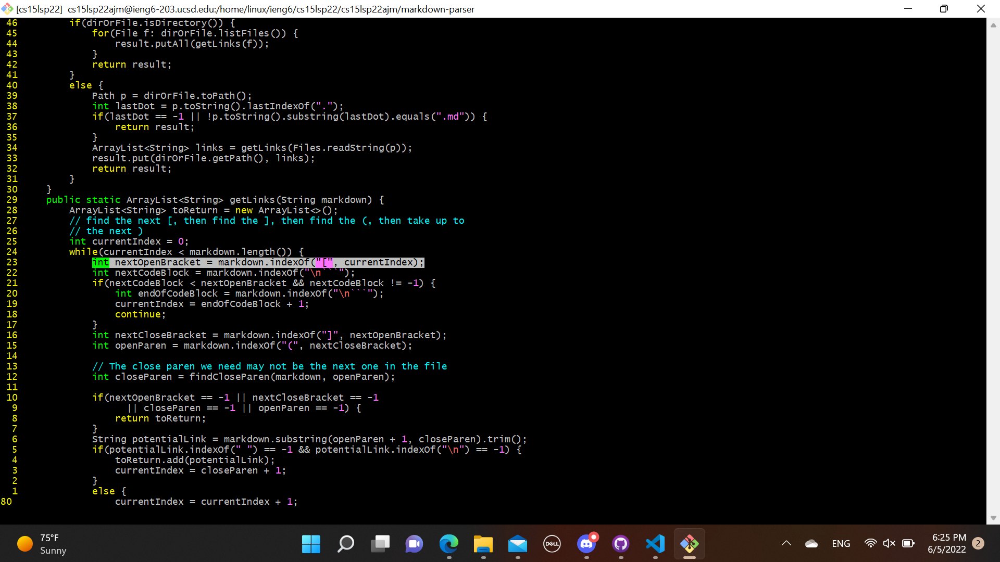
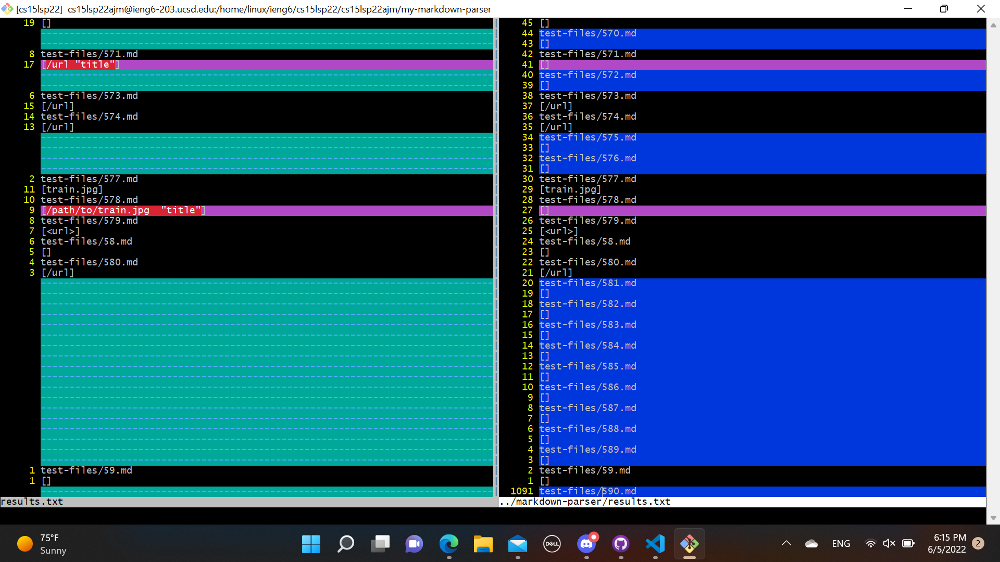
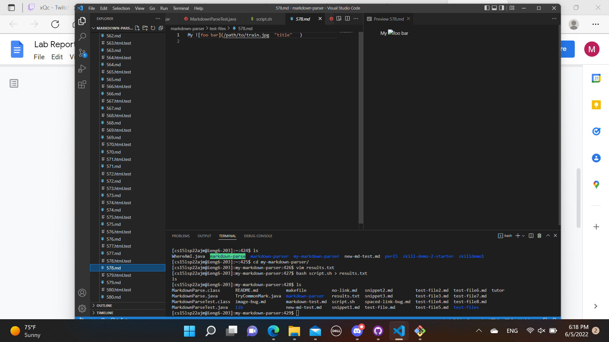

I used vimdiff in order to find the files with different outputs.

# test-file 571
[test file 571](https://github.com/nidhidhamnani/markdown-parser/blob/main/test-files/571.md?plain=1)

The result from my-markdown-parser is correct.

The expected output should be [ ].

The bug is that the code does not check whether there is a character in front of the brackets. As such, before the highlighted piece of code, we should take into account whether something is in front of the bracket or not.

# test-file 578
[test file 578](https://github.com/nidhidhamnani/markdown-parser/blob/main/test-files/578.md?plain=1)

The result from my-markdown-parser is correct

The expected output should [ ].

The error here is similar to that of test-file 571. The code needs to check whether or not there is a character in front of the bracket or not.