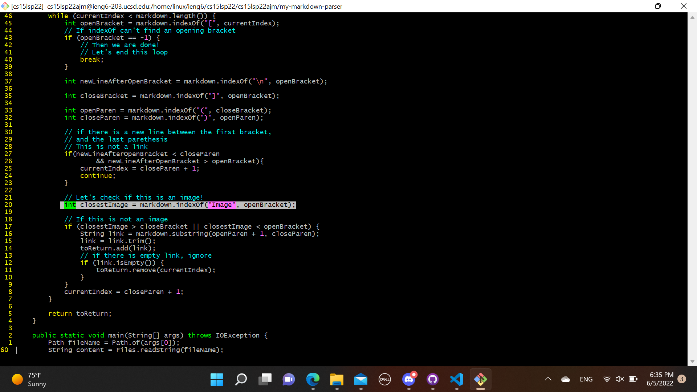
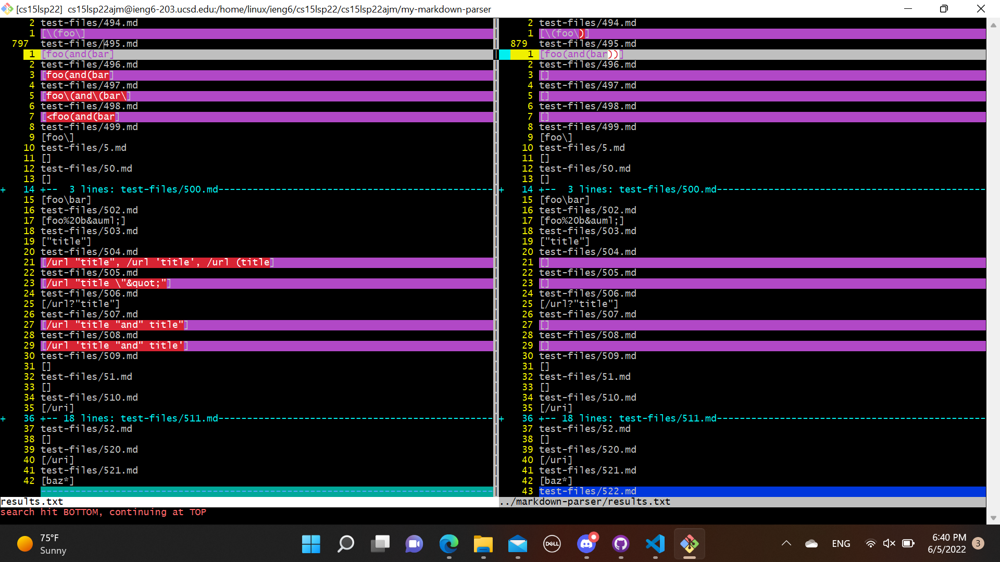
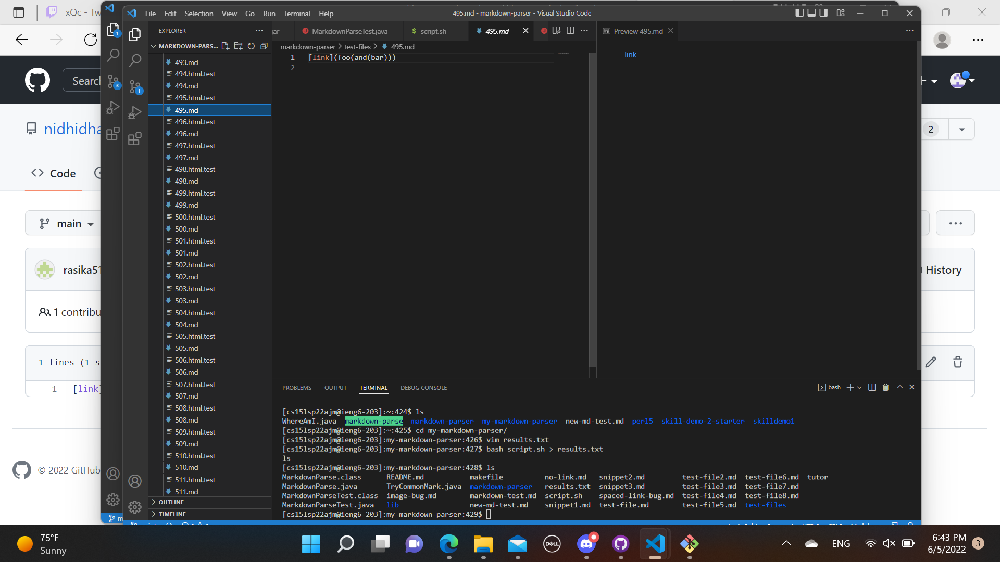
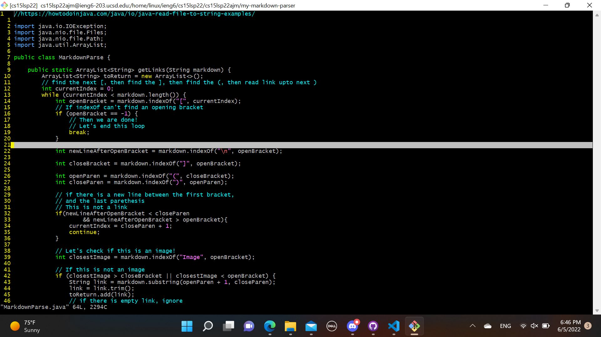

I used vimdiff in order to find the files with different outputs. I looked over and saw the differences from vimmdiff which were interesting, and used them.

# test-file 578
[test file 578](https://github.com/nidhidhamnani/markdown-parser/blob/main/test-files/578.md?plain=1)

The result from markdown-parser is correct.

The expected output should be [ ].

The bug is that the code does not check whether there is a character in front of the brackets. We only look if it says "image".

# test-file 495

The result from my-markdown-parser is corect

The result should be [foo(and(bar))].

The bug is that our code just stops at the first closing parenthesis. We should write some code that keeps in mind whether or not there are nested parenthesis.